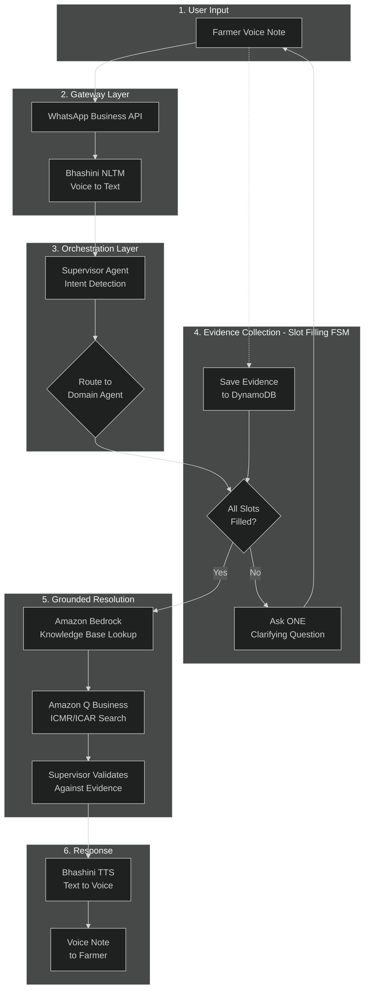
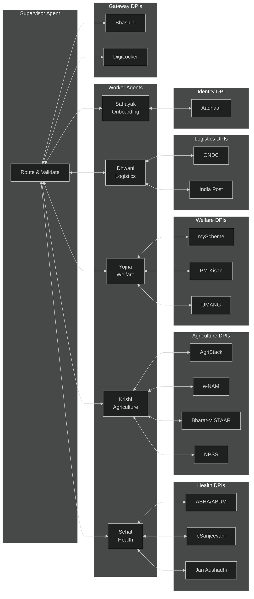
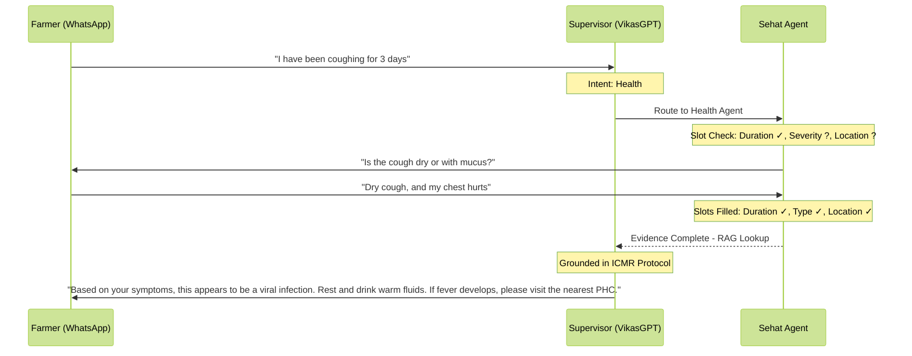
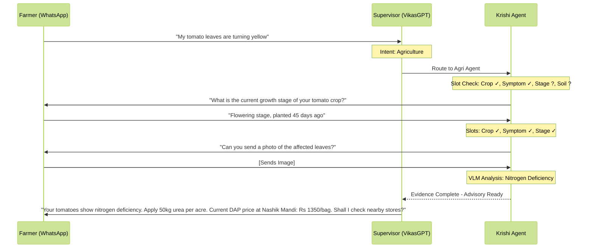
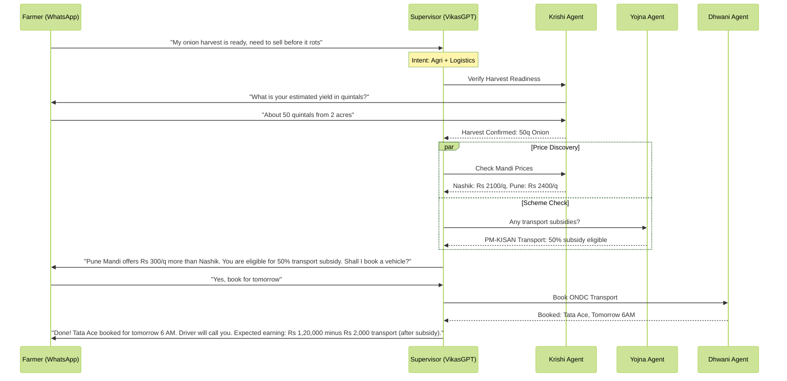
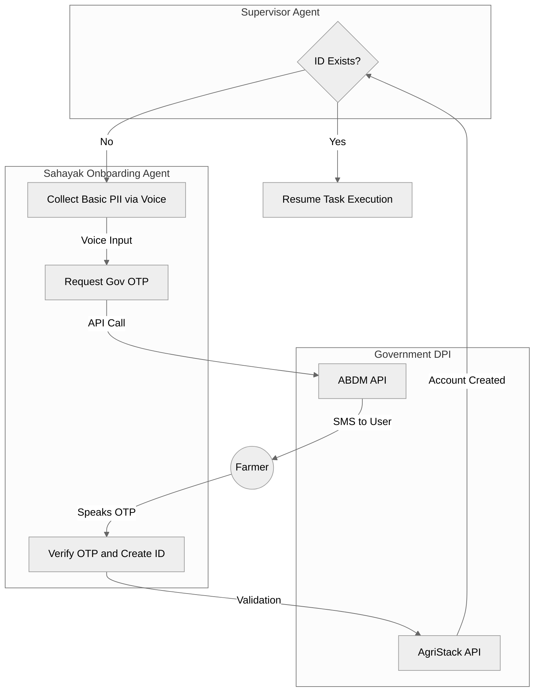

# Design Document: VikasGPT (Conversational OS)

## 1. Executive Summary

> *"VikasGPT implements a **Stateful Agentic Workflow** on Amazon Bedrock. We replace the 'Black Box' of standard chat with a transparent **Evidence-First Slot-Filling mechanism**, ensuring every piece of advice is grounded in user-provided data and ICMR/ICAR-verified knowledge bases."*

VikasGPT is a **Conversational Operating System** for rural Indian households, built on **Amazon Bedrock Multi-Agent Collaboration**. It moves beyond simple Q&A to **Interactive Consulting**, using a state-aware loop to gather evidence before providing advice.

---

## 2. Tech Stack (AWS-Native & India-Regional)

| Layer | Component | Description |
|-------|-----------|-------------|
| **Interface** | **WhatsApp Business API** | Primary channel for rural users (low data, high trust). |
| **Linguistics** | **Bhashini API (STT/TTS)** | Handles 22+ regional dialects; converts speech to text for AI processing. |
| **The Brain** | **Amazon Bedrock** | Hosts **Claude 3.5 Opus** (for reasoning) and **Claude 3 Haiku** (for fast slot-filling). |
| **Discovery** | **Amazon Q Business** | Enterprise search across ICMR/ICAR knowledge bases for grounded responses. |
| **Memory** | **Amazon DynamoDB** | Stores the "Case File" (slots) and conversation state persistently. |
| **Logic** | **AWS Lambda & Step Functions** | Serverless execution of the "Question-Answer" loops and agent hand-offs. |
| **RAG** | **Amazon Bedrock Knowledge Bases** | Vector store for ICMR health protocols and ICAR agricultural guidelines. |
| **Security** | **AWS KMS & Bedrock Guardrails** | Dual-vault encryption for Health/Wealth and safety filters for medical advice. |

---

## 3. Architectural Pattern: Stateful Hierarchical Slot-Filling

We use **Hierarchical Routing** with **Amazon Bedrock Multi-Agent Collaboration**:

1. **Supervisor Agent** identifies the domain (Health/Agri/Welfare)
2. **Worker Agent** uses a **Finite State Machine (FSM)** to check off its "Evidence Checklist" (Slots)
3. Only after all required slots are filled does the agent move to the "Resolution" node
4. **Amazon Q Business** provides enterprise-grade search across verified knowledge bases

### 3.1 System Architecture (Evidence-First Flow)

#### Diagram Explanation: Evidence-First Architecture

This diagram shows the **slot-filling state machine** that ensures grounded responses:

| Phase | Component | Action |
|-------|-----------|--------|
| **1. Input** | Farmer | Sends voice note via WhatsApp |
| **2. Gateway** | Bhashini | Converts voice to text in 22 languages |
| **3. Orchestration** | Supervisor | Detects intent (Health/Agri/Welfare) and routes to domain agent |
| **4. Slot Filling** | Worker Agent | Checks if all required evidence slots are filled |
| | | If NO → Asks ONE clarifying question, saves response, loops back |
| | | If YES → Proceeds to resolution |
| **5. Resolution** | Knowledge Base | RAG lookup in ICMR/ICAR verified guidelines via Amazon Q Business |
| | Supervisor | Validates response against gathered evidence (hallucination prevention) |
| **6. Output** | Bhashini | Converts text response to voice note |

**Key Principle:** The system **never provides advice** until all evidence slots are filled and the response is validated against verified knowledge bases.

### 3.2 DPI Integration Map

#### Diagram Explanation: DPI Integration

| Agent | Connected DPIs | Purpose |
|-------|----------------|---------|
| **Supervisor** | Bhashini, DigiLocker | Language translation, verified document access |
| **Sehat** | ABHA, eSanjeevani, Jan Aushadhi | Health records, tele-consultation, medicine locator |
| **Krishi** | AgriStack, e-NAM, Bharat-VISTAAR, NPSS | Farmer ID, Mandi prices, ICAR advisory, pest detection |
| **Yojna** | myScheme, PM-Kisan, UMANG | 2000+ schemes, income support, 1200+ services |
| **Dhwani** | ONDC, India Post | Transport booking, remote delivery |
| **Sahayak** | UIDAI (Aadhaar) | e-KYC, OTP-based onboarding |

---

## 4. Workflow Examples

### 4.1 Example 1: Healthcare Flow (Sehat Agent)

#### Diagram Explanation: Healthcare Flow

This sequence diagram demonstrates the **evidence-first slot-filling** pattern for health queries:

| Step | Action | What Happens |
|------|--------|--------------|
| 1 | User Input | Farmer sends voice note describing symptoms ("coughing for 3 days") |
| 2 | Intent Detection | Supervisor identifies this as a health query and routes to Sehat Agent |
| 3 | Slot Analysis | Sehat checks required evidence slots: Duration ✓ (3 days), Severity ❓, Location ❓ |
| 4 | Evidence Gathering | Sehat asks ONE clarifying question to fill missing slots |
| 5 | User Response | Farmer provides additional evidence (dry cough, chest pain) |
| 6 | RAG Lookup | Once all slots filled, Sehat queries ICMR protocols via Amazon Bedrock Knowledge Base |
| 7 | Grounded Response | Supervisor delivers advice grounded in verified medical guidelines |

**DPIs Involved:** ABHA (for health records if available), eSanjeevani (for tele-consultation escalation)

---

### 4.2 Example 2: Agriculture Flow (Krishi Agent)

#### Diagram Explanation: Agriculture Flow

This sequence demonstrates **multimodal evidence collection** (text + image) for crop diagnostics:

| Step | Action | What Happens |
|------|--------|--------------|
| 1 | User Input | Farmer describes crop problem (yellowing tomato leaves) |
| 2 | Intent Detection | Supervisor routes to Krishi Agent for agricultural advisory |
| 3 | Slot Analysis | Krishi identifies: Crop ✓, Symptom ✓, Growth Stage ❓, Soil History ❓ |
| 4 | Evidence Gathering | Krishi asks about growth stage (single-turn inquiry principle) |
| 5 | Image Request | Krishi requests a photo for visual analysis (multimodal capability) |
| 6 | VLM Analysis | Amazon Bedrock Claude's vision model analyzes the leaf image |
| 7 | Price Lookup | Krishi queries e-NAM/AGMARKNET for current Mandi prices |
| 8 | Grounded Advisory | Response includes diagnosis + actionable remedy + pricing |

**DPIs Involved:** AgriStack (farmer profile), e-NAM/AGMARKNET (Mandi prices), Bharat-VISTAAR (ICAR advisory), NPSS (pest detection)

---

### 4.3 Example 3: Cross-Domain Flow (Harvest + Logistics + Schemes)

#### Diagram Explanation: Cross-Domain Flow

This sequence showcases **parallel multi-agent coordination** for complex requests spanning multiple domains:

| Step | Action | What Happens |
|------|--------|--------------|
| 1 | User Input | Farmer has a multi-faceted need: sell harvest before spoilage |
| 2 | Intent Detection | Supervisor identifies Agriculture + Logistics intents |
| 3 | Harvest Verification | Krishi Agent confirms harvest readiness and quantity |
| 4 | **Parallel Execution** | Supervisor triggers TWO agents simultaneously: |
| | → Krishi | Fetches real-time Mandi prices from e-NAM |
| | → Yojna | Checks PM-Kisan/PMFBY for transport subsidies via UMANG |
| 5 | Integrated Response | Supervisor combines price comparison + subsidy info |
| 6 | User Confirmation | Farmer approves booking |
| 7 | Logistics Booking | Dhwani Agent books vehicle via ONDC Network |
| 8 | Confirmation | Complete booking details with cost projection |

**DPIs Involved:** e-NAM (prices), myScheme (eligibility), PM-Kisan (subsidy status), UMANG (service access), ONDC (logistics booking)

---

## 5. Specialized Worker Agents

### 5.1 Agent Overview & DPI Integration Master List

| Agent | Domain | Evidence Slots | DPI Integrations | Purpose |
|-------|--------|----------------|------------------|---------|
| **Supervisor** | Orchestration | - | Bhashini (NLTM), DigiLocker | Language translation (22 dialects), verified ID documents |
| **Sehat** | Health | Symptoms, Location, Duration, Intensity, History | ABHA/ABDM, eSanjeevani, Jan Aushadhi Sugam | Health records, tele-consultation, medicine store locator |
| **Krishi** | Agriculture | Crop_Type, Growth_Stage, Visual_Symptoms, Soil_History | AgriStack, e-NAM/AGMARKNET, Bharat-VISTAAR, NPSS | Farmer ID, Mandi prices, ICAR advisory, pest detection |
| **Yojna** | Welfare | Aadhaar_Linked, Income_Bracket, Land_Holding | myScheme, PM-Kisan/PMFBY, UMANG | Scheme discovery (2000+), income support, 1200+ services |
| **Dhwani** | Logistics | Pickup_Location, Destination, Cargo_Type, Weight | ONDC Network, India Post | Transport booking, physical delivery in remote areas |
| **Sahayak** | Onboarding | Name, Mobile, Aadhaar_Consent | UIDAI (Aadhaar) | e-KYC, OTP-based user registration |

### 5.2 Sahayak Agent: Missing Account Fallback

#### Diagram Explanation: Sahayak Onboarding Flow

This flowchart illustrates the **failsafe onboarding process** for users without government IDs:

| Step | Component | Action |
|------|-----------|--------|
| 1 | Supervisor | Checks if user has existing ABHA/AgriStack ID |
| 2 | Decision | If ID exists → proceed to task execution |
| 3 | Sahayak | If no ID → collect basic PII via voice (name, mobile, consent) |
| 4 | UIDAI | Trigger Aadhaar-based e-KYC via OTP |
| 5 | ABDM API | Request OTP sent to user's registered mobile |
| 6 | Farmer | User receives SMS and speaks the OTP back |
| 7 | Validation | Sahayak verifies OTP with UIDAI |
| 8 | AgriStack | Creates linked Farmer ID with land records |
| 9 | Loop Back | Returns to Supervisor with fresh credentials |

**Key Principle:** The entire onboarding is **voice-based** - no typing, no app download, no literacy required.

**DPIs Involved:** UIDAI (Aadhaar e-KYC), ABDM (health ID creation), AgriStack (farmer ID creation)

---

## 6. State Management & Handoff Logic

### 6.1 Context Switching

The Supervisor handles mid-conversation domain switches using **Shared Memory** stored in DynamoDB. Each conversation maintains a context graph that tracks active agents, filled slots, and pending tasks.

| Turn | User Message | Supervisor Action | Active Agent | Saved State |
|------|--------------|-------------------|--------------|-------------|
| 1 | "My wheat has some disease" | Detect Agri intent | Krishi | crop: wheat, issue: disease |
| 2 | "Also I have fever" | Pause Krishi, switch domain | Sehat | Krishi state saved to memory |
| 3 | "Continue about wheat" | Resume Krishi | Krishi | Restored: crop: wheat, issue: disease |

This enables **seamless multi-domain conversations** without losing context.

### 6.2 Agent Handoff Rules

| Trigger | From Agent | To Agent | Condition |
|---------|------------|----------|-----------|
| Life Event Match | Krishi/Sehat | Yojna | Crop loss or health emergency detected |
| Harvest Ready | Krishi | Dhwani | All harvest slots confirmed |
| Missing ID | Any | Sahayak | DPI lookup returns "Not Found" |
| Emergency | Sehat | Human Escalation | Red-level triage detected |
| Task Complete | Any Worker | Supervisor | All slots filled, response delivered |

---

## 7. API Contracts (Complete DPI Integration)

### 7.1 Gateway & Identity DPIs

| DPI System | Agent | API Type | Purpose |
|------------|-------|----------|---------|
| **Bhashini (NLTM)** | Supervisor | gRPC/REST | Speech-to-Text and Text-to-Speech in 22 Indian languages |
| **DigiLocker** | Supervisor | REST + OAuth 2.0 | Digital vault for verified ID documents (Aadhaar, PAN, Land Records) |
| **UIDAI (Aadhaar)** | Sahayak | REST + OTP | e-KYC and OTP-based authentication for new user onboarding |

### 7.2 Health DPIs

| DPI System | Agent | API Type | Purpose |
|------------|-------|----------|---------|
| **ABHA/ABDM** | Sehat | REST + OAuth 2.0 | Ayushman Bharat Health Account - longitudinal health records |
| **eSanjeevani** | Sehat | REST | Tele-consultation platform - escalation to real doctors |
| **Jan Aushadhi Sugam** | Sehat | REST | Locate nearest generic medicine stores for prescriptions |

### 7.3 Agriculture DPIs

| DPI System | Agent | API Type | Purpose |
|------------|-------|----------|---------|
| **AgriStack** | Krishi | REST | Farmer ID, linked land records, crop history, soil data |
| **e-NAM / AGMARKNET** | Krishi | REST | Real-time Mandi prices for price parity across 7000+ markets |
| **Bharat-VISTAAR** | Krishi | REST | ICAR-integrated AI advisory for crop management |
| **NPSS** | Krishi | REST | National Pest Surveillance System for automated disease detection |

### 7.4 Welfare DPIs

| DPI System | Agent | API Type | Purpose |
|------------|-------|----------|---------|
| **myScheme** | Yojna | REST | Primary database for 2000+ central and state government schemes |
| **PM-Kisan / PMFBY** | Yojna | REST | Income support status and crop insurance claims |
| **UMANG** | Yojna | REST | Master API to access 1200+ individual government services |

### 7.5 Logistics DPIs

| DPI System | Agent | API Type | Purpose |
|------------|-------|----------|---------|
| **ONDC Network** | Dhwani | REST + Callbacks | Open network for hyper-local logistics and e-commerce |
| **India Post** | Dhwani | REST | Physical delivery of documents or seeds in remote areas |

---

## 8. Security & Compliance

### 8.1 Dual-Vault Architecture

| Vault | Data Types | Encryption Key |
|-------|------------|----------------|
| **Health Vault** | ABHA records, symptoms, prescriptions | KMS Key A |
| **Wealth Vault** | Land records, income, bank details | KMS Key B |

### 8.2 Amazon Bedrock Guardrails

- **Medical Advice Filter:** Blocks unverified health claims
- **PII Redaction:** Automatically masks Aadhaar/phone in logs
- **Emergency Escalation:** Routes red-level cases to human operators

---

## 9. Failsafe Design Principles

This architecture is designed to be **Failsafe**:

| Scenario | System Response |
|----------|-----------------|
| User doesn't know what to say | Interview Logic guides with one question at a time |
| User doesn't have a government ID | Sahayak Agent creates account via voice OTP |
| User has a cross-domain crisis | Supervisor coordinates multiple agents in parallel |
| Agent service is offline | Graceful degradation with fallback message |
| Network is slow (2G/3G) | Voice notes compressed; async processing enabled |
