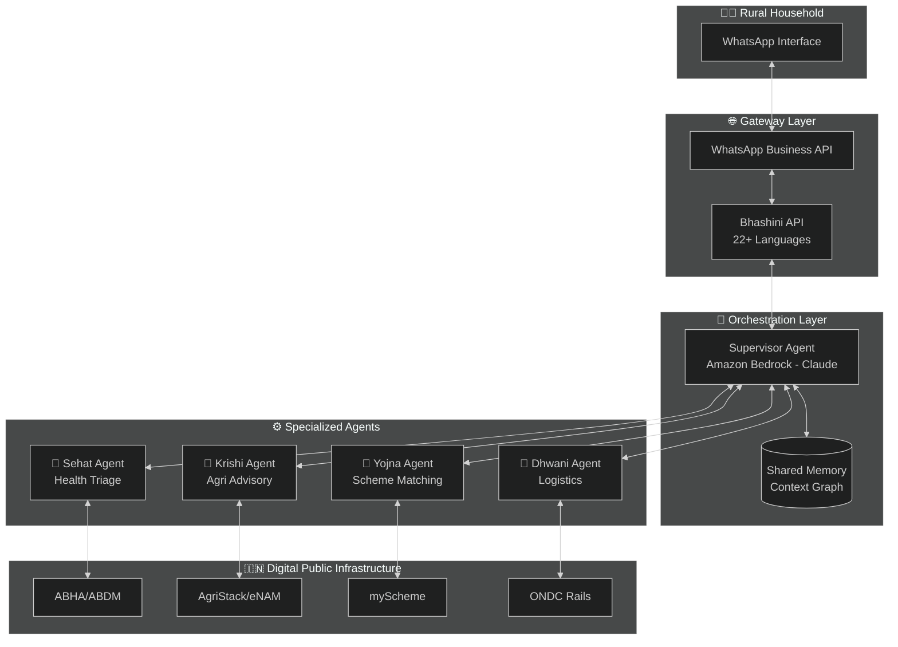
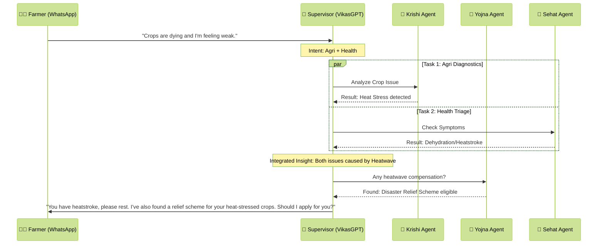

# Design Document: VikasGPT (Conversational OS)

## 1. Unified Multi-Agent Framework
VikasGPT is built on a **Supervisor-Worker** multi-agent architecture designed to handle concurrent tasks across health, wealth, and welfare domains through a single conversational thread.

### 2. Multi-Agent Orchestration Detail

#### 2.1 System Architecture

#### 2.2 Example: Multi-Domain Request Flow

#### 2.3 Supervisor Agent (The Brain)
* **Technology:** Amazon Bedrock (Claude 3.5 Sonnet).
    * **Logic:** Employs a **Hierarchical Orchestration** model. It decomposes complex user inputs (e.g., "I'm sick and my onions are rotting") into parallel sub-tasks.
    * **State Management:** Uses **Shared Memory** to maintain context across agents, ensuring the Sehat agent knows the Krishi agent's findings for cross-domain insights.

### 3. Integrated Specialized Workers
* **Sehat Agent (Health):** * **Data Source:** Connects via **ABHA Sandbox** APIs to medical records.
    * **Logic:** Uses RAG (Retrieval-Augmented Generation) grounded in **ICMR triage protocols** to classify cases into Green/Yellow/Red severity levels.
* **Krishi Agent (Agri):** * **Integrations:** **Bharat-VISTAAR** for advisory and **eNAM** for real-time Mandi price parity.
    * **Tools:** Implements a **Vision-Language Model (VLM)** for pest and disease identification from user-uploaded images.
* **Yojna Agent (Social Welfare):** * **Logic:** A proactive "Scanning Agent" that continuously matches the household's profile (from AgriStack) against **myScheme** databases to find eligible subsidies.
* **Dhwani Agent (Logistics):** * **Execution:** Acts as the "Tool Agent" to book services via **ONDC** shared mobility rails and **India Post** APIs.

### 4. Security & Compliance (Privacy-by-Design)
* **Dual-Vault Encryption:** Data is logically separated into a "Health Vault" and "Wealth Vault" using different **AWS KMS keys**.
* **Governance:** Implements a **Reviewer Agent** (Critique Mechanism) to validate advice against government safety standards before transmission to the user, mitigating hallucinations.