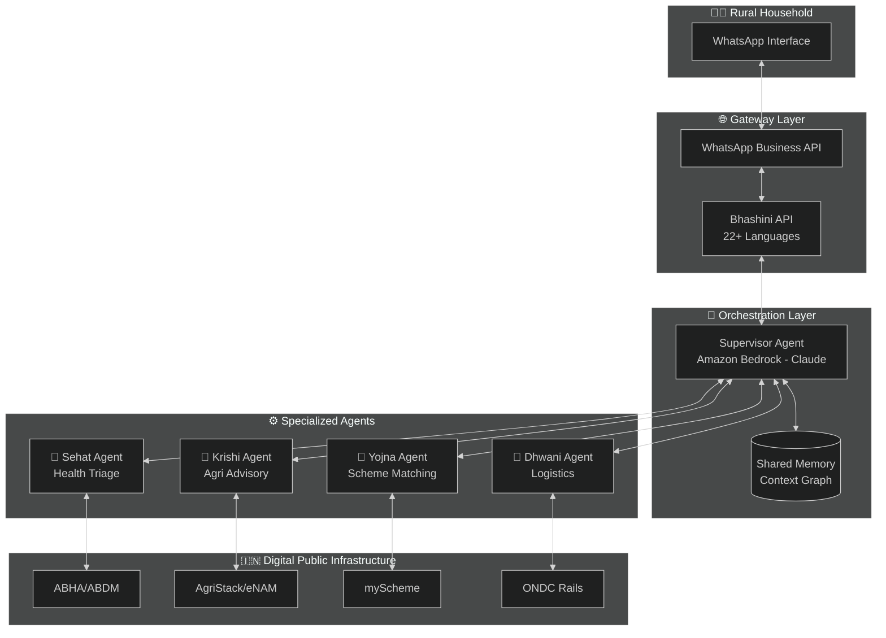
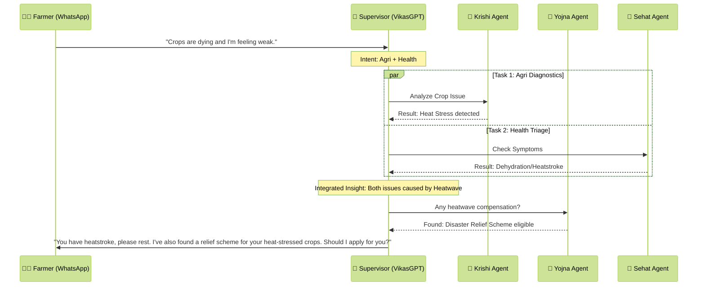
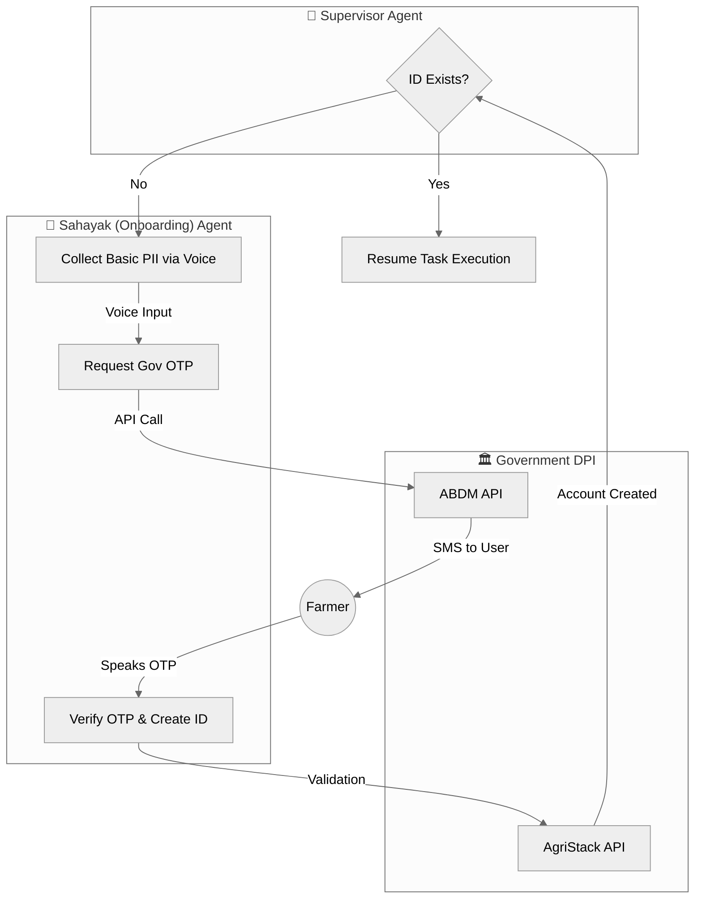

# Design Document: VikasGPT (Conversational OS)

## 1. Unified Multi-Agent Framework
VikasGPT is built on a **Supervisor-Worker** multi-agent architecture. It moves beyond "Q&A" to **Interactive Consulting**, using a state-aware loop to gather evidence before providing advice.

## 2. Evidence-Based Orchestration (Slot-Filling)
The system treats every interaction as a "Case File." No worker agent provides a resolution until the **Evidence Frame** is complete.

* **Stateful Memory:** Uses Amazon DynamoDB to track "Slots" (Evidence units).
* **Investigation Mode:** If a user says "I have a cough," the Supervisor identifies a missing slot: `[Duration]`. It pauses the resolution and generates a voice question: *"I understand. How many days have you had this cough?"*

### 2.1 System Architecture

### 2.2 Example: Multi-Domain Request Flow

## 3. Integrated Specialized Workers

* **Sehat Agent (Health):**
    * **Evidence Slots:** [Symptoms, Location, Duration, Intensity, History].
    * **Grounding:** RAG-based lookup in ICMR manuals via Amazon Bedrock.
* **Krishi Agent (Agri):**
    * **Evidence Slots:** [Crop_Type, Growth_Stage, Visual_Symptoms, Soil_History].
    * **Tools:** Multimodal image analysis for "Evidence Photos" of pests.
* **Yojna Agent (Welfare):**
    * **Evidence Slots:** [Aadhaar_Linked, Income_Bracket, Land_Holding].
    * **Logic:** Matches "Life Events" from other agents to subsidies.
* **Sahayak Agent (Onboarding):**
    * **Function:** Bridges the gap for users without ABHA/AgriStack IDs.
    * **Logic:** Manages voice-based OTP authentication and account provisioning.

### 3.1 Sahayak Agent: Missing Account Fallback

## 4. Technical Stack
* **Language:** Bhashini API (Speech-to-Speech in 22 dialects).
* **Brain:** Amazon Bedrock (Claude 3.5 Sonnet) for agent reasoning.
* **Execution:** AWS Step Functions to manage the "Interview State" and fallback logic.
* **Security:** AWS KMS Dual-Vault encryption (Health vs. Wealth isolation).

---

## 💡 Failsafe Design Principles

This architecture is designed to be **Failsafe**:

1. **If the user doesn't know what to say** → The Interview Logic guides them with one question at a time.
2. **If the user doesn't have an account** → The Sahayak Agent builds it via voice-based OTP.
3. **If the user has a cross-domain crisis** → The Supervisor coordinates all relevant agents in parallel.